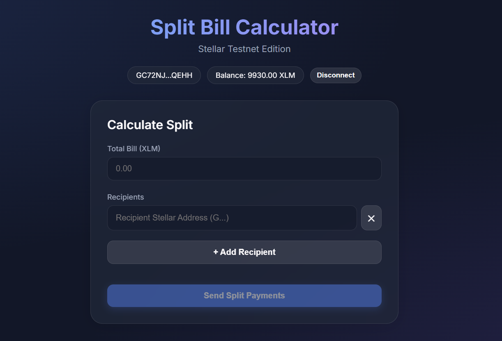
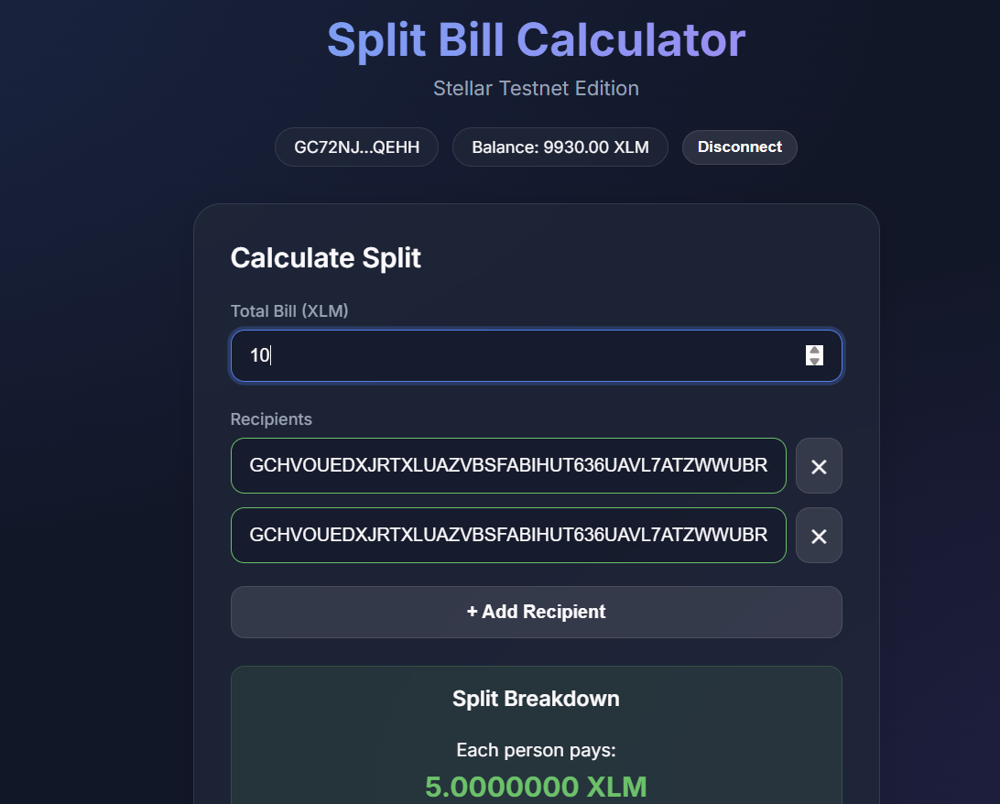
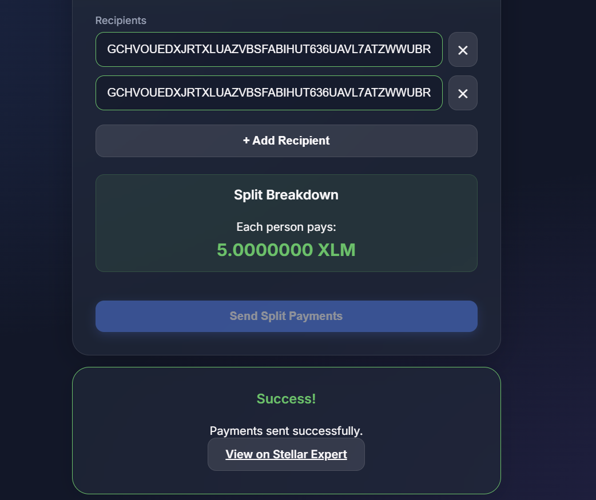

# Split Bill Calculator

A Stellar Testnet dApp that allows users to seamlessly split expenses and send XLM payments to multiple recipients in a single transaction.

## Overview
The Split Bill Calculator simplifies the process of dividing costs among friends or colleagues using the Stellar network. Instead of sending multiple individual payments, users can enter a total bill amount, add their friends' Stellar addresses, and the dApp will automatically calculate the equal split and bundle all payments into one efficient transaction. 

## Features
- **Wallet Integration**: Connect and disconnect the Freighter Wallet extension.
- **Network Validation**: Automatically detects and warns if the user is not connected to the Stellar Testnet.
- **Balance Display**: Fetches and displays the user's current native XLM balance.
- **Dynamic Recipient List**: Add and remove multiple recipient Stellar addresses dynamically.
- **Real-time Validation**: Validates recipient addresses in real-time to ensure they are valid Ed25519 public keys.
- **Automatic Split Calculation**: Instantly calculates the XLM amount per person based on the total bill and valid recipients.
- **Insufficient Funds Check**: Disables the send button if the user's balance cannot cover the total bill.
- **Multi-Payment Transactions**: Builds a single transaction containing multiple payment operations using the Stellar SDK.
- **Status Feedback**: Provides step-by-step UI updates (Building, Pending Signature, Submitting, Success, Error).
- **Explorer Integration**: Provides a direct link to Stellar Expert upon successful transaction execution.

## Tech Stack
- **Frontend**: HTML5, Vanilla CSS, JavaScript (ES6 Modules)
- **Bundler**: Vite
- **Stellar Libraries**: 
  - `stellar-sdk` (v13+)
  - `@stellar/freighter-api` (v6+)
- **Plugins**: `vite-plugin-node-polyfills` (for Node.js core module support in the browser)

## Prerequisites
- **Freighter Wallet**: Install the [Freighter browser extension](https://www.freighter.app/).
- **Network Setting**: Ensure your Freighter wallet is set to **Testnet**.
- **Node.js**: Version 18.0.0 or higher.

## Setup Instructions (Run Locally)

1. **Clone the repository**
   ```bash
   git clone https://github.com/mehtaranjana745-blip/Split-Bill-Calculator.git
   ```

2. **Navigate into the project directory**
   ```bash
   cd Split-Bill-Calculator
   ```

3. **Install dependencies**
   ```bash
   npm install
   ```

4. **Start the development server**
   ```bash
   npm run dev
   ```

5. **Open the app**
   Visit the local URL provided in your terminal (usually `http://localhost:5173/`).

## How to Fund Your Testnet Wallet
To interact with the app, you need Testnet XLM. You can fund your Freighter Testnet account for free using the Stellar Friendbot:
[Fund your account with Friendbot](https://laboratory.stellar.org/#account-creator?network=test)

## How to Use the App
1. **Connect Wallet**: Click "Connect Wallet" on the main screen to link your Freighter extension.
2. **Enter Total Bill**: Input the total amount of XLM to be split.
3. **Add Recipients**: Click "+ Add Recipient" and paste the Stellar addresses (starting with 'G') of the people you want to pay.
4. **Review Split**: The app will validate the addresses and display the split amount per person.
5. **Send Payments**: Click "Send Split Payments".
6. **Sign Transaction**: A Freighter popup will appear. Review the transaction and click "Approve".
7. **View Result**: Once submitted to the network, a success message will appear with a link to view the transaction on Stellar Expert.

## Screenshots


*(Replace these placeholders with actual screenshots after testing the app on Testnet.)*





## Project Structure
```text
.
├── index.html        # Main HTML structure and UI layout
├── app.js            # Core dApp logic, Stellar SDK & Freighter integration
├── style.css         # Modern styling, variables, and glassmorphism UI
├── vite.config.js    # Vite bundler configuration & Node polyfills
├── package.json      # Project dependencies and npm scripts
└── package-lock.json # Dependency lockfile
```

## Known Limitations
- **Testnet Only**: The app is hardcoded to connect to the Stellar Testnet (`https://horizon-testnet.stellar.org`).
- **Native XLM Only**: Only supports splitting the native XLM asset, not custom Stellar tokens or stablecoins.
- **Equal Splits**: Assumes an equal split among all valid recipients; custom amounts per person are not supported.
- **No Transaction History**: The app does not display past transactions or split history.

## License
MIT License